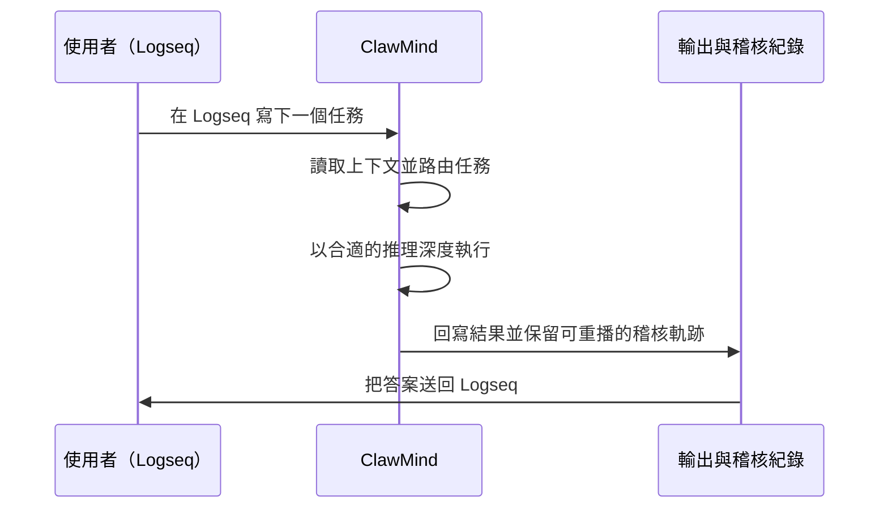

# ClawMind：把 AI 思考工作，落在 Logseq 這個可見的地方


> 從聊天，走向互動。
> 你不是在跟 AI 對話，你是在借 AI 和自己一起思考。

ClawMind 做的事情，說白了很簡單：它把 Logseq 變成一個**受控的 AI 工作台**。這個工作台不是為了讓答案看起來更炫，而是為了讓整個思考過程保持**可見、可檢查、可重做**。

現在大多數 AI 工具都有一個共同問題：**答案留下來了，路徑不見了**。

ClawMind 不只是幫你產生答案。它更在意的是，答案出來以後，那條思考和執行的路徑還在不在。換句話說，它不是把 AI 當成黑箱，而是把 AI 的工作過程整理成一個看得見的流程。

ClawMind 依賴經過 **schema 驗證的結構化輸出**，所以它選後端模型時看重的不是單純能力上限，而是**可靠性**。這是一個很實際的取捨。因為真正要進入工作流的系統，最怕的不是笨，而是不穩。

[UserManual.md](./UserManual.md) | [TaskManual.md](./TaskManual.md)

## Demo

看看一個 Logseq 任務，怎麼一步步變成可追蹤的流程、回寫的結果，以及一條能留存的稽核軌跡。

https://github.com/user-attachments/assets/99e62538-e782-47f3-be69-966e32e90ac1

## 為什麼是 ClawMind

ClawMind 是為那種對正確性、可追蹤性、操作清晰度有要求的知識工作而設計的。一般 AI 工具確實快，但它們常常把上下文藏起來，把決策過程做成不可見，最後讓輸出變得很難回放，也很難審查。

ClawMind 走的是另一條路。它把 Logseq 當成人與系統互動的表面，把頁面連結當成明確的上下文結構，再用受控的任務路由去平衡快速回答、深度推理與可預測回寫。它不把短期記憶偷偷塞進一次性的 prompt 裡，而是盡量讓上下文保持可見、可連結、可延續。

所以最後得到的，不只是比較好的答案，而是一個更可靠的執行模型：AI 的行為有邊界，回寫結果可重播，整個過程也比較適合事後審計。ClawMind 本質上是一層工作流系統，服務那些希望思考工作能長期保持可見、可檢視、可留存的人。

目前 ClawMind 支援 **兩個執行後端**(擇一)：

- `codex_cli`：走 Codex CLI 路徑
- `gemini_api`：走 Gemini API 路徑

如果你要看安裝方式、`.env` 設定、首次執行與使用細節，請看 [UserManual.md](./UserManual.md)。
如果你要看任務撰寫方式、路由訊號與模型選擇規則，請看 [TaskManual.md](./TaskManual.md)。

## 它怎麼運作

ClawMind 會把使用者可見的工作流程，從任務記錄一路帶到受控回寫。



### 執行邊界

- **路由**和推理分開
- **推理**和回寫分開
- 回寫本身保持**受控**且**可重複**

## 為可靠性而設計

- 每個任務都有穩定身分，方便長期追蹤
- 上下文和執行期行為彼此分離，降低知識與執行互相污染的機率
- 回寫機制強調可重播，避免同一流程反覆執行後結果越來越漂
- AI 不會繞過受控回寫層，直接寫入 Logseq

## 專案結構

```text
app/                核心應用程式碼
tests/              單元測試
run_logs/           主要執行稽核紀錄
runtime_artifacts/  執行產物
```

## 環境需求

- Windows
- Logseq
- AI (選一個)
  - Codex CLI ()
  - `gemini_api` 路徑所需的 Gemini API key
- Python 3.13+

## 執行方式

啟動常駐 worker，持續監看 Logseq 任務、進行路由執行，並以受控方式把結果寫回：

```powershell
clawmind run-worker
```

## Roadmap

- 支援 Gemini CLI 
- 支援 macOS


## Contact

- GitHub Issues: https://github.com/pigsly/ClawMind/issues
- X.com @pigslybear

