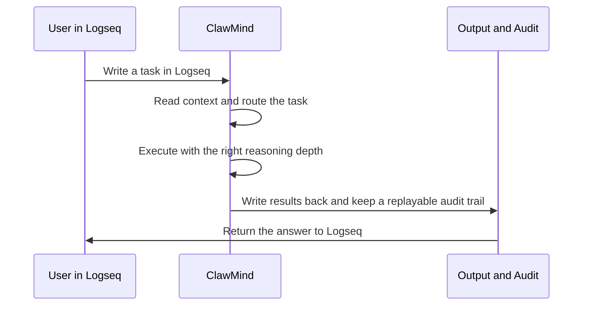

# ClawMind -- AI for Thinking Work, Grounded in Logseq


> From chat to interaction.
> You’re not talking to AI—you’re thinking with yourself.

ClawMind turns Logseq into a controlled AI workspace for people who need thinking work to stay visible, reviewable, and repeatable.

In most AI tools, the answer remains but the path disappears.

ClawMind does not just generate answers. It turns thinking work into a process that stays visible after the answer is done.

## Demo

Watch a single Logseq task turn into a traced workflow, a written-back result, and a durable audit trail.

https://github.com/user-attachments/assets/99e62538-e782-47f3-be69-966e32e90ac1

## Why ClawMind

ClawMind is built for knowledge workflows where correctness, traceability, and operational clarity matter. Most AI tools are fast, but their context is hidden, their decisions are hard to inspect, and their outputs are difficult to replay.

ClawMind takes a different path. It uses Logseq as the human-facing workflow surface, page links as explicit context structure, and controlled task routing to balance fast answers, deeper reasoning, and deterministic writeback. Instead of burying short-term memory inside a transient prompt, it keeps context visible, linkable, and easier to carry across tasks.

The result is not just better answers, but a more reliable execution model: bounded AI behavior, reproducible writeback, and audit-friendly records that can be reviewed after the fact. ClawMind is a workflow layer for people who need thinking work to remain visible, reviewable, and durable over time.

For installation, `.env` setup, first run, and usage details, see [UserManual.md](./UserManual.md).
For task wording, routing signals, and model selection rules, see [TaskManual.md](./TaskManual.md).

## How It Works

ClawMind guides the user-visible workflow from task capture to controlled writeback.



### Execution Boundaries

- Routing is separated from reasoning.
- Reasoning is separated from writeback.
- Writeback remains controlled and repeatable.

## Built for Reliability

- Each task keeps a stable identity, so work can be tracked consistently over time.
- Context and runtime behavior stay separated, reducing accidental spillover between knowledge and execution.
- Writeback is designed to stay repeatable, so the same workflow does not create drifting results.
- AI does not write to Logseq directly without the controlled writeback layer.

## Project Structure

```text
app/                Core application code
tests/              Unit tests
run_logs/           Execution audit records (main)
runtime_artifacts/  Execution artifacts
```

## Environment Requirements

- Windows
- Logseq
- Codex CLI
- Python 3.13+

## Run

Start the persistent worker to continuously watch Logseq tasks, route execution, and write results back in a controlled way:

```powershell
clawmind run-worker
```

## Roadmap

- Support macOS.
- Support Gemini CLI and Claude CLI.
  
  

## Contact

- GitHub Issues: https://github.com/pigsly/ClawMind/issues
- X.com @pigslybear
