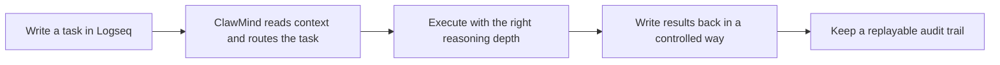

# ClawMind -- Logseq AI Coworker


> From chat to interaction.
> You’re not talking to AI—you’re thinking with yourself.

ClawMind turns Logseq into a controlled AI workspace for people who need thinking work to stay visible, reviewable, and repeatable.

- It turns everyday notes, questions, and task blocks into a controlled execution flow that is understandable, replayable, and auditable.

- Unlike a generic AI chat tool, ClawMind separates flow control, reasoning, and writeback into explicit system boundaries.

- Work Runner manages task intake and state transitions, Codex Runner handles reasoning-heavy execution, and the Deterministic Executor writes results back in a repeatable way.

## Demo

Watch ClawMind turn a simple Logseq task into a controlled, traceable, and replayable AI workflow.

https://github.com/user-attachments/assets/99e62538-e782-47f3-be69-966e32e90ac1

## Why ClawMind

ClawMind is built for knowledge workflows where correctness, traceability, and operational clarity matter. Most AI tools are fast, but their context is hidden, their decisions are hard to inspect, and their outputs are difficult to replay.

ClawMind takes a different path. It uses Logseq as the human-facing workflow surface, page links as explicit context structure, and controlled task routing to balance fast answers, deeper reasoning, and deterministic writeback. Instead of burying short-term memory inside a transient prompt, it keeps context visible, linkable, and easier to carry across tasks.

The result is not just better answers, but a more reliable execution model: bounded AI behavior, reproducible writeback, and audit-friendly records that can be reviewed after the fact. ClawMind is a workflow layer for people who need thinking work to remain visible, reviewable, and durable over time.

For installation, `.env` setup, first run, and usage details, see [UserManual.md](./UserManual.md).
For task wording, routing signals, and model selection rules, see [TaskManual.md](./TaskManual.md).

## How It Works

ClawMind guides the user-visible workflow from task capture to controlled writeback.



### Roles

- Work Runner is the flow controller.
  It scans DOING tasks, normalizes id::, moves tasks into WAITING, builds execution context, and coordinates the full run.
- Codex Runner is the reasoning engine.
  It handles the AI-heavy part of the task and returns structured output, but it does not directly mutate Logseq pages or task state.
- Deterministic Executor is the writeback layer.
  It applies results in a repeatable way, writes answer pages and journal links, and helps preserve idempotency and auditability.

## Core Guarantees

- stable `id::` primary key
- runtime / knowledge domain separation
- writeback idempotency
- AI does not write to Logseq directly

## Project Structure

```text
app/                Core application code
tests/              Unit tests
run_logs/           Execution audit records (main)
runtime_artifacts/  Execution artifacts
```

## Environment Requirements

- Windows
- Logseq
- Codex CLI
- Python 3.13+

## Run

Start the persistent worker to continuously watch Logseq tasks, route execution, and write results back in a controlled way:

```powershell
clawmind run-worker
```

## Roadmap

- Support macOS.
- Support Gemini CLI and Claude CLI.
  
  

## Contact

- GitHub Issues: https://github.com/pigsly/ClawMind/issues
- X.com @pigslybear
