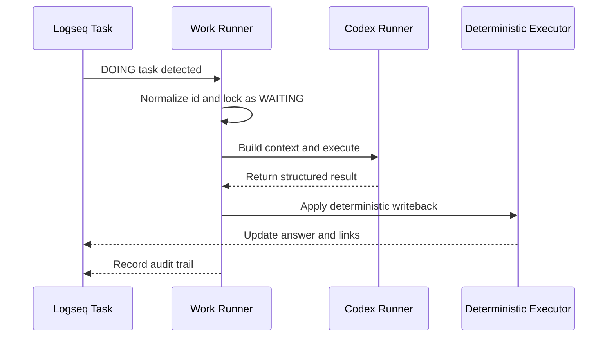

# ClawMind -- Logseq AI Coworker


> From chat to interaction.
> You’re not talking to AI—you’re thinking with yourself.

ClawMind is a Logseq-native workflow runner for individuals who need AI execution with human oversight.

- It turns everyday notes, questions, and task blocks into a controlled execution flow that is understandable, replayable, and auditable.

- Unlike a generic AI chat tool, ClawMind separates flow control, reasoning, and writeback into explicit system boundaries.

- Work Runner manages task intake and state transitions, Codex Runner handles reasoning-heavy execution, and the Deterministic Executor writes results back in a repeatable way.

## Demo

https://github.com/user-attachments/assets/99e62538-e782-47f3-be69-966e32e90ac1

## Quick Start

For installation, .env setup, and first run instructions, see [UserManual.md](./UserManual.md).

## Why ClawMind

ClawMind is designed for knowledge workflows where correctness, traceability, and operational clarity matter.

- Logseq remains the human-facing workflow surface.
- AI execution is bounded by explicit runtime and writeback rules.
- Every run can leave reproducible audit evidence in
  `run_logs/` and `runtime_artifacts/`.
- The system is built to reduce ad hoc task handling and turn repeated thinking work into durable process assets.

## How It Works

  ClawMind turns a Logseq task into a controlled workflow:

  `DOING -> WAITING -> execute -> writeback -> audit`



### Roles

- Work Runner is the flow controller.
  It scans DOING tasks, normalizes id::, moves tasks into WAITING, builds execution context, and coordinates the full run.
- Codex Runner is the reasoning engine.
  It handles the AI-heavy part of the task and returns structured output, but it does not directly mutate Logseq pages or task state.
- Deterministic Executor is the writeback layer.
  It applies results in a repeatable way, writes answer pages and journal links, and helps preserve idempotency and auditability.

## Core Guarantees

- stable `id::` primary key
- runtime / knowledge domain separation
- writeback idempotency
- AI does not write to Logseq directly

## Project Structure

```text
app/                Core application code
tests/              Unit tests
run_logs/           Execution audit records (main)
runtime_artifacts/  Execution artifacts
```

## Environment Requirements

- WINDOWS OS
- Install Codex CLI (Plus / month)
- Install Logseq
- Python 3.13+

For setup details and step-by-step usage, see [UserManual.md](./UserManual.md).

## Installation

Recommended for development:

```powershell
uv sync
```

For user installation, environment configuration, and `.env` setup, see [UserManual.md](./UserManual.md).

## Run

Start the persistent worker:

```powershell
clawmind run-worker
```

For startup behavior, stop instructions, and runtime configuration, see [UserManual.md](./UserManual.md).

## CLI Helper Commands

Check version:

```powershell
clawmind version
```

Show installation info:

```powershell
clawmind install-info
```

Upgrade:

```powershell
clawmind upgrade --method auto
clawmind upgrade --method pipx
clawmind upgrade --method uv
clawmind upgrade --method pip
```

Method mapping:

- `pipx install clawmind` -> `clawmind upgrade --method pipx`
- `uv tool install clawmind` -> `clawmind upgrade --method uv`
- `pip install clawmind` -> `clawmind upgrade --method pip`

## Roadmap

- Support macOS.
- Support Gemini CLI and Claude CLI.
  
  

## Contact

- X.com @pigslybear
